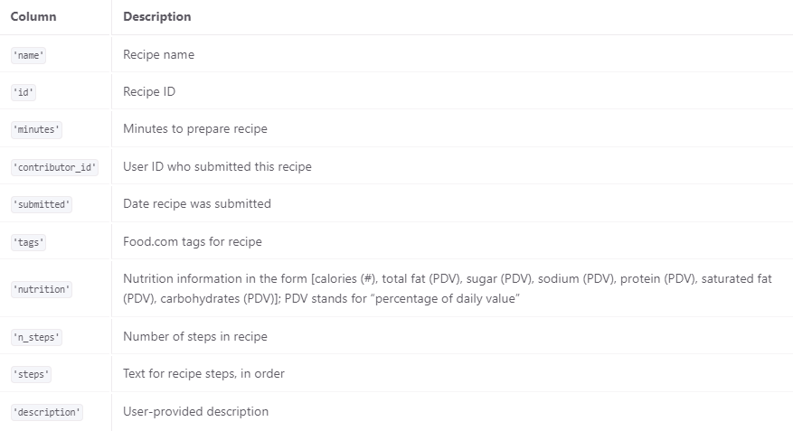
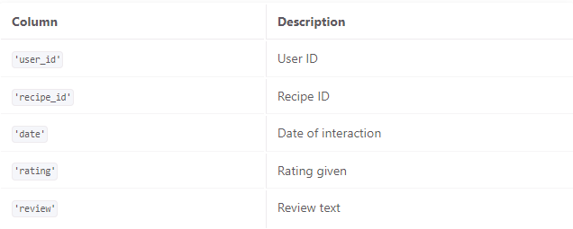

# Is Average Rating of Recipes Correlated to Calories?! 
By Athulith Paraselli & Jennifer Hung
## Introduction

In society where people are becoming progressively more conscious about healthy eating and diet culture, we wonder how this would affect their perception of whether a meal was good or bad. Many health-conscious people hyper-focus on calorie counting and restrictive eating. Thus, we ask the question: Does the number of calories in a recipe affect the average rating of the food? By proposing this question, we investigate whether people’s perception of higher calorie recipes is worse rated or if they are simply more delicious.

We were given two datasets containing recipes and ratings respectively. For the recipes dataset, it contained the information of 83782 recipes with calories varying from 0 to 45,609 on food.com. The 10 columns are as follows:

The second dataset with information on user ratings of different recipes consisted of 731,927 total reviews. This dataset contains the following 5 columns:

The columns that are relevant to our questions were `'nutrition'` (from the recipes dataset) and `'rating'` (from the rating dataset.) The `'nutrition'` column consisted of calories (#), total fat (PDV), sugar (PDV), sodium (PDV), protein (PDV), saturated fat (PDV), carbohydrates (PDV). As our question focuses on the effect of calories on average rating, we extracted each value from the nutrition list and saved it as individual columns. From there, we took ​​`'calories'` for further analysis. As for the `'rating'` column, it included information about how each user rated a certain recipe (from 1 to 5). Our question looked more at how each recipe with individual calories differed in rating, so we found it relevant to take the average rating for each recipe. Therefore, we grouped by recipes, found the mean rating for each recipe and assigned a new column named `'avg_rating'`. 

## Clearning and EDA

### Data Cleaning
Before we could analyze our data, we had to merge the two dataframes so that we could have  our relevant information on one dataframe. We also cleaned up the data to make sure our dataframe is readable and correct. These are the steps we went through: 
1. **Left merged recipes with ratings as one dataset:**
   We merged on “id” and “recipe id” respectively to ensure that we keep every column in the recipes dataset. This is to ensure that recipes that no one rated will be included in our analysis.
2. **Filled the ratings of 0 with NaN:**
   We made sure to replace all the ratings of 0 with NaN because 0 could sometimes mean missing or invalid rating. The ratings of 0 will also lower the average rating for a recipe when in reality it likely meant it wasn’t rated by a user. We merged this Series with the already merged data frame so that each recipe had its own average rating. 
3. **Changed the `nutrition` column from string of lists to lists:**
   The values in the `nutrition` column looked like a list containing 7 floats (calories (#), total fat (PDV), sugar (PDV), sodium (PDV), protein (PDV), saturated fat (PDV), carbohydrates (PDV)), but when we printed it out, it was actually a string object. Thus, we had to remove the square brackets and split it to turn the string into a list.
4. **Split the values in `nutrition` into columns:**
   For our question, we needed the calories information stored in the first value of the list in `nutrition`. We decided to extract each value in the list and create columns for each one: `calories`, `total_fat`, `sugar`, `sodium`, `protein`, `saturated_fat`, `carbohydrates`. We also turned the type from strings to floats because after step 3 of cleaning we stored it as strings in a list.
5. **Replaced 0 minutes with NaN:**
   We discovered that there were 3 instances of 0 minute values for minutes cooking, which seemed not plausible. There must be some time needed to make a recipe, so we replaced all the 0 minute values with NaN.
6. **Dropped duplicate recipes:**
   We removed all the duplicate recipe ids from the dataframe as we only were taking into account the calories of a specific recipe and its average rating. Our initial left merge made the recipe appear multiple times for every time a user rated it. 

Our cleaned DataFrame has 83782 rows and 5 columns: `id`, `minutes`, `calories`, `protein`, `avg_rating`. The first 5 rows are shown in this DataFrame below: 

|     id |   minutes |   calories |   protein |   avg_rating |
|-------:|----------:|-----------:|----------:|-------------:|
| 275022 |        50 |      386.1 |        41 |            3 |
| 275024 |        55 |      377.1 |        13 |            3 |
| 275026 |        45 |      326.6 |        37 |            3 |
| 275030 |        45 |      577.7 |        14 |            5 |
| 275032 |        25 |      386.9 |         1 |            5 |

### Univariate Analysis
With the data cleaned and the average rating for each recipe calculated, we were able to look at the distribution of calories of cooking time for each recipe and the distribution of average rating across all recipes. 

#### Distribution of Recipe Calories 
As the data had up to 45k calories and was extremely right-skewed, we only plotted the data up to 5,000 calories. The resulting histogram is shown below. 
The histogram is still mostly right-skewed, with most of the recipes ranging around 100-500 calories. This seems to fit the fact that recipes from Food.com are mostly home-made meals, thus the calorie count would be lower per meal. An average meal should be around 400-500 calories. 

<iframe src="assets/Calories-Distribution.html" width=800 height=600 frameBorder=0></iframe>

#### Distribution of Average Rating 
We plotted a histogram for the average rating of recipes as shown below. 
The graph appears to be left-skewed, with most of the recipes rating around 4.75-5 out of 5. It seems like the food in our Food.com dataset is mostly ranked very highly. We concluded that people tend to go online to rate food only if the food is exceptionally good. This also made us wonder if there is a strong correlation between calories and ratings. 

<iframe src="assets/Rating-Distribution.html" width=800 height=600 frameBorder=0></iframe>

### Bivariate Analysis
#### Box plot of Average Rating and Calories 
To further understand the relationship between Average Rating and Calories, we must plot a bivariate graph. We tried plotting the scatterplot, but it showed a very column-like structure. Thus, we decided to group the average ratings in bins of [0-1) (0 inclusive, 1 exclusive), all the way to [4,5] (4 inclusive, 5 inclusive). Now the `average_rating` is a categorical variable, we could use boxplots to visualize the relationship between average ratings and calories. 

From our box plot above, we note that [0-1) has the most spread. The median decreases, then increases and flats out as ratings go up. Generally, the relationship between the average ratings and calories seems to be the same across all 5 bins. There are also quite a lot of large outliers for each group.

<iframe src="assets/Bivariate-plot.html" width=800 height=600 frameBorder=0></iframe>

### Interesting Aggregates
We looked further into the relationship between the measures of center (mean, median) and the max and min for calories in each group of average rating. This was important because by comparing the mean and median for each group, we can observe how outliers can affect mean. From our grouped DataFrame, it appears that lower rating groups had higher average calories, which supported our hypothesis that higher calorie foods tend to have lower ratings because people are more health-conscious in this day and age. The median shows a similar trend to the mean, which means that the outliers don't appear to affect it that much or perhaps proportionately. 
## Assessment of Missingness

## Hypothesis Testing
